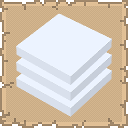

# More Cloud Layers

## Installation

* [Modrinth](https://modrinth.com/mod/more-cloud-layers)
* [CurseForge](https://www.curseforge.com/minecraft/mc-mods/more-cloud-layers)

## Support
  
If you encounter bugs or wish to contribute:
* [Report any problems you find.](https://github.com/armaninyow/More-Cloud-Layers/discussions/categories/issues)
* [Share your ideas for new features.](https://github.com/armaninyow/More-Cloud-Layers/discussions/categories/suggestions)

## Changelog

  

  
### 2.0.0—26.x
* Added support for Minecraft 26.1, 26.1.1, and 26.1.2
* Replaced Cloth Config with YetAnotherConfigLib (YACL) for the in-game config screen
* Added a toggle that assigns each active layer a random, distinct slot instead of stacking sequentially
* Added a toggle and a separate pattern dropdown that removes a portion of each layer's texture to thin out dense layer counts
### 1.1.0—1.21.x
* Added support for reading the true cloud height even when other mods override it
* Fixed extra cloud layers not following Sodium Extra's custom cloud altitude setting
* Improved compatibility with mods that change how vanilla clouds are rendered
### 1.0.0—1.21.x
* Initial Release

